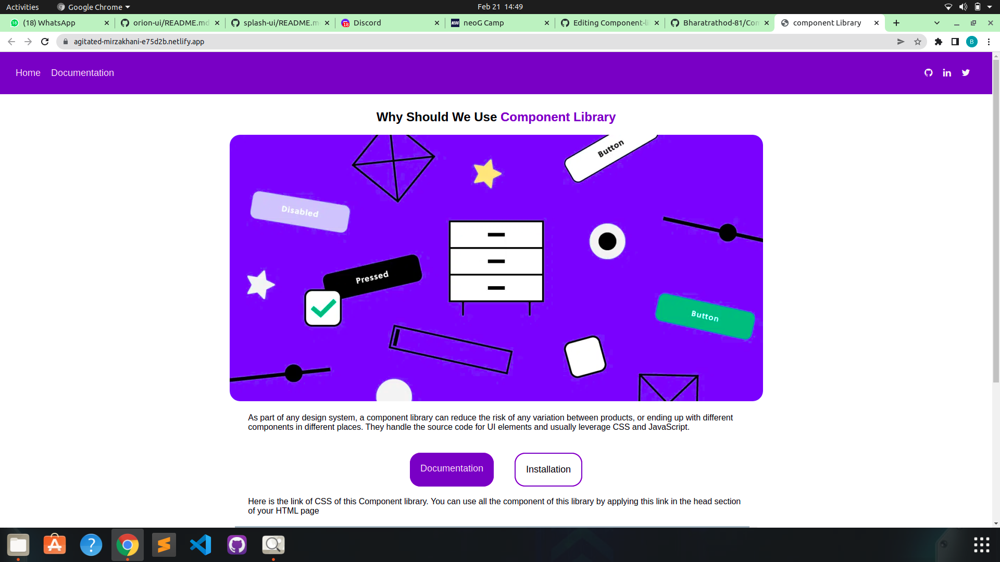

# Component-library

This CSS Component library helps to build your web apps faster. You can develop your project layouts easily.

## Demo :


## Installation :

Copy and paste the code in the head tag of your HTML document. So that you can style your components by just adding class names to your HTML elements.

```html
<link rel="stylesheet" href="https://agitated-mirzakhani-e75d2b.netlify.app/Components/Components.css">
```
## Technologies used

- HTML
- CSS
- JavaScript

## Components available

- [Avatar](https://agitated-mirzakhani-e75d2b.netlify.app/components/avatar/avatar)
- [Badges](https://agitated-mirzakhani-e75d2b.netlify.app/components/badge/badge)
- [Alerts](https://agitated-mirzakhani-e75d2b.netlify.app/components/alert/alert)
- [Button](https://agitated-mirzakhani-e75d2b.netlify.app/components/buttons/button)
- [Cards](https://agitated-mirzakhani-e75d2b.netlify.app/components/card/card)
- [Images](https://agitated-mirzakhani-e75d2b.netlify.app/components/image/image)
- [Input](https://agitated-mirzakhani-e75d2b.netlify.app/components/input/input)
- [Text Utilities](https://agitated-mirzakhani-e75d2b.netlify.app/components/text-utility/text_utility)
- [Lists](https://agitated-mirzakhani-e75d2b.netlify.app/components/list/list)
- [Navigation](https://agitated-mirzakhani-e75d2b.netlify.app/components/navigation/navigation)
- [Snackbar](https://agitated-mirzakhani-e75d2b.netlify.app/components/snackbar/snackbar)
